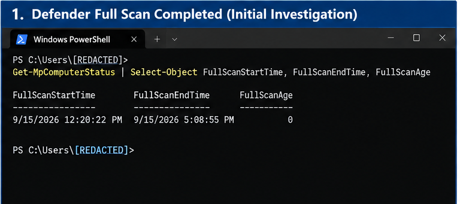
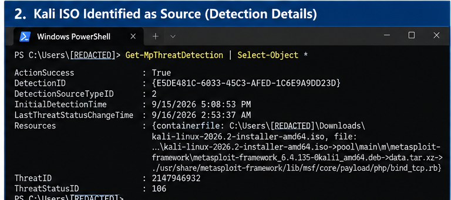
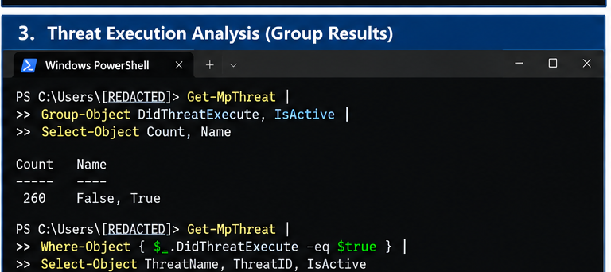
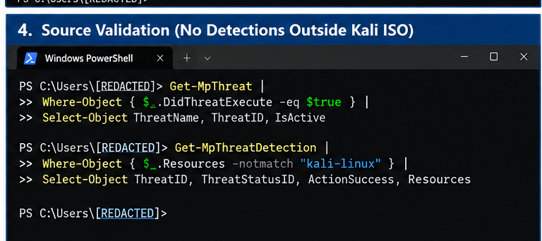
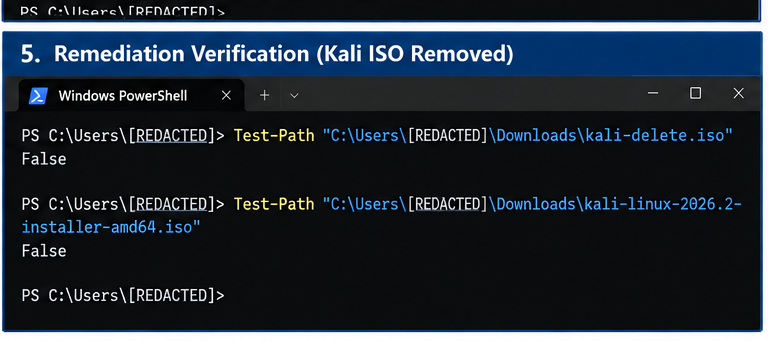
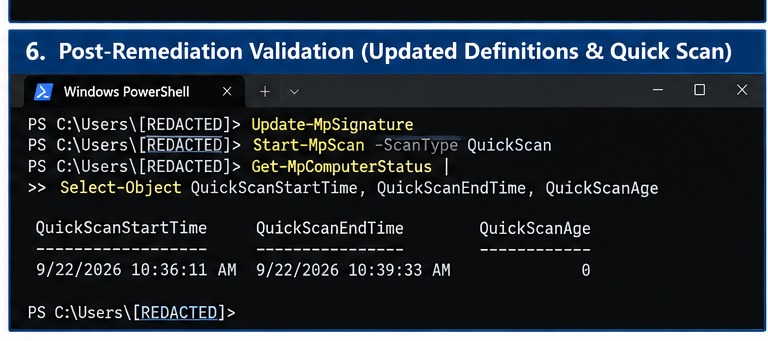

# Microsoft Defender Endpoint Investigation

> Endpoint security investigation using Microsoft Defender and PowerShell for detection analysis, remediation, and post-incident validation.

## Overview

This project documents a Windows endpoint security investigation performed after Microsoft Defender identified multiple security-tool and potentially malicious signatures during a full system scan.

The goal of the investigation was to determine the source of the detections, assess whether Defender reported any of the identified threats as having executed, identify whether detection resources existed outside the suspected source, and complete remediation and post-remediation validation.

Using Microsoft Defender, PowerShell, and Defender event data, I traced the reviewed detections to offensive-security tools contained within a Kali Linux installation ISO that had previously been downloaded for use in a virtual lab environment.

The investigation was completed across multiple sessions in a personal lab environment. Timestamps shown in the evidence reflect the actual investigation and remediation timeline.

## Investigation Objectives

The investigation focused on answering the following questions:

- What did Microsoft Defender detect?
- What was the source of the detected content?
- Did Defender report any identified threats as having executed?
- Were detection resources identified outside the suspected source?
- Could the identified source be safely removed?
- Did additional detections appear during post-remediation validation?

## Environment & Tools

| Technology | Purpose |
|---|---|
| Windows | Endpoint under investigation |
| Microsoft Defender Antivirus | Endpoint scanning and threat detection |
| PowerShell | Detection analysis, filtering, remediation, and validation |
| Microsoft Defender event data | Review of scan and detection activity |
| Kali Linux ISO | Source investigated during detection analysis |
| Oracle VirtualBox | Virtual lab environment associated with the Kali ISO |

## Investigation

### Phase 1 — Detection & Initial Analysis

A Microsoft Defender full system scan was performed as part of the initial investigation. PowerShell was used to verify the scan status and confirm that the full scan completed successfully.



*Figure 1. PowerShell verification of the completed Microsoft Defender full system scan.*

The completed scan established a baseline for reviewing Defender's detection history and determining the source and scope of the identified threats.

### Phase 2 — Source Identification

After confirming the full scan had completed, I reviewed Microsoft Defender's detection data using PowerShell to identify the resources associated with the detected threats.

Analysis of the `Resources` field showed that the reviewed detections pointed to files contained within a Kali Linux installation ISO located in the Downloads directory. The ISO had previously been downloaded for use with Oracle VirtualBox in a virtual security lab.

The detected content included offensive-security tools and exploit components packaged with Kali Linux, including Metasploit-related files.



*Figure 2. Microsoft Defender detection data showing a detected resource contained within the Kali Linux installation ISO.*

This finding established the Kali Linux ISO as the common source associated with the reviewed Defender detections. However, identifying the source alone did not establish whether any of the detected threats had executed or whether Defender had identified resources elsewhere on the Windows system.

### Phase 3 — Threat Execution Analysis

After identifying the Kali Linux ISO as the common source associated with the reviewed detections, I used PowerShell to examine Microsoft Defender threat records for evidence of execution.

I grouped the threat records by the `DidThreatExecute` and `IsActive` properties and then separately queried for any records where `DidThreatExecute` was reported as `True`.

The reviewed results showed 260 threat records with `DidThreatExecute` set to `False`. A separate query for threats with `DidThreatExecute = True` returned no results.



*Figure 3. PowerShell analysis of Microsoft Defender threat records showing the execution-status results.*

The `IsActive` status was not treated as evidence that 260 malicious processes were actively running. Instead, the execution-status findings were evaluated alongside Defender's resource information and additional scope analysis.

Based on the reviewed Defender records, no identified threat was reported as having executed.

### Phase 4 — Scope Validation

After reviewing threat execution status, I performed additional analysis to determine whether Microsoft Defender had identified detection resources outside the Kali Linux source.

Using PowerShell, I filtered Defender's detection records to exclude resources containing references to `kali-linux`. The query returned no additional results in the reviewed detection data.



*Figure 4. PowerShell filtering of Microsoft Defender detection records to identify resources outside the Kali Linux source.*

This provided additional evidence that the reviewed Defender detections were associated with content contained within the Kali Linux ISO rather than separate resources elsewhere on the Windows endpoint.

Combined with the execution analysis, the findings supported the conclusion that the reviewed detections were consistent with offensive-security content packaged within the Kali Linux image. No Defender detection resources outside that source were identified during this analysis.

### Phase 5 — Containment & Remediation

After the detection source and scope were analyzed, I removed the Kali Linux ISO from the Windows endpoint as a remediation step.

The file was renamed and then removed using PowerShell. After removal, I used `Test-Path` to verify that neither the renamed file nor the original Kali Linux ISO path remained on the system.



*Figure 5. PowerShell verification confirming removal of the identified Kali Linux ISO.*

Both `Test-Path` checks returned `False`, confirming that the identified ISO was no longer present at either location.

Removing the source addressed the Defender detections associated with the Kali Linux installation image while preserving the investigation evidence and findings documented during the earlier analysis.

### Phase 6 — Post-Remediation Validation

After removing the identified Kali Linux ISO, I performed post-remediation validation using Microsoft Defender and PowerShell.

Defender security intelligence was updated, and a Quick Scan was performed. PowerShell was then used to verify that the scan completed successfully.

I also queried Defender for detection records generated during the post-remediation review period. The query returned no results in the reviewed output.



*Figure 6. Post-remediation validation showing the completed Microsoft Defender Quick Scan and review for recent detections.*

The completed scan and absence of additional detection records in the reviewed post-remediation output provided supporting evidence that the remediation was successful.

These results were treated as validation of the remediation performed during this investigation rather than proof that the endpoint was free from every possible security threat.

## Key Findings

- Microsoft Defender identified multiple security-tool, exploit, and potentially malicious signatures during the investigation.

- Analysis of Defender's `Resources` data traced the reviewed detections to offensive-security content contained within a Kali Linux installation ISO that had been downloaded for use in a virtual lab environment.

- The reviewed Microsoft Defender threat records reported `DidThreatExecute = False`, and a separate query for records reporting `DidThreatExecute = True` returned no results.

- Filtering Defender detection records to exclude references to the Kali Linux source returned no additional resources in the reviewed data.

- The identified Kali Linux ISO was removed from the Windows endpoint, and PowerShell `Test-Path` checks confirmed that the file was no longer present at the tested paths.

- Following remediation, Microsoft Defender security intelligence was updated and a Quick Scan completed successfully. A query for detection records generated during the reviewed post-remediation period returned no results.

### Conclusion

The investigation determined that the reviewed Microsoft Defender detections were consistent with offensive-security and penetration-testing content packaged within the Kali Linux installation image rather than evidence, from the reviewed Defender records, of those detected threats executing on the Windows endpoint.

The investigation demonstrates the importance of validating security alerts through source identification, execution analysis, scope validation, remediation, and post-remediation verification rather than drawing conclusions from detection names alone.

## Incident Response Framework Mapping

The investigation incorporated activities aligned with the NIST Cybersecurity Framework (CSF), particularly the Detect, Respond, and Recover functions.

| NIST CSF Function | Application in This Investigation |
|---|---|
| Detect | Microsoft Defender scanning and detection data were reviewed to identify potential security threats and establish the initial scope of the investigation. |
| Respond — Analyze | PowerShell and Defender data were used to identify the detection source, evaluate threat execution status, and determine whether detection resources existed outside the identified Kali Linux source. |
| Respond — Mitigate | The identified Kali Linux ISO was removed from the Windows endpoint after the detection source and scope were analyzed. |
| Recover | Defender security intelligence was updated, a post-remediation Quick Scan was completed, and recent detection records were reviewed to validate the endpoint after remediation. |

### Investigation Workflow

**Detect → Analyze → Validate Scope → Remediate → Verify**

This workflow helped ensure that remediation decisions were based on evidence collected during the investigation rather than on detection names alone.

## Lessons Learned

This investigation reinforced several important incident response and endpoint security practices:

- **A detection does not automatically mean execution.** Security alerts must be analyzed in context before determining whether malicious activity occurred.

- **Detection source matters.** Reviewing Defender's `Resources` data was critical for tracing the reviewed detections to offensive-security content contained within the Kali Linux ISO.

- **Security lab tools can generate legitimate endpoint detections.** Penetration-testing distributions may contain exploit frameworks, payloads, and other tools that endpoint security products are designed to detect.

- **Validate the scope before reaching a conclusion.** Filtering detection records for resources outside the identified source provided additional evidence for determining the scope of the reviewed Defender activity.

- **Remediation should be verified.** `Test-Path`, a subsequent Defender scan, and post-remediation detection review were used to confirm the actions taken rather than assuming that removal alone completed the investigation.

- **Conclusions should match the evidence.** The investigation supported conclusions about the Defender records that were reviewed, but those findings were not treated as proof that every possible security threat had been eliminated from the endpoint.

### Key Takeaway

The most valuable part of this investigation was learning to move beyond the initial alert and ask: **What was detected, where did it come from, did it execute, what else was affected, and how can the remediation be validated?**

That evidence-driven process turned a collection of Defender alerts into a structured endpoint security investigation.

## PowerShell Commands Used

PowerShell was used throughout the investigation to review Microsoft Defender status, analyze threat records, validate the scope of the detections, perform remediation, and verify post-remediation results.

### Verify Full Scan Completion

```powershell
Get-MpComputerStatus |
Select-Object FullScanStartTime, FullScanEndTime, FullScanAge
```

**Purpose:** Verified that the Microsoft Defender full system scan completed and reviewed its start time, completion time, and scan age.

### Review Defender Detection Records

```powershell
Get-MpThreatDetection
```

**Purpose:** Reviewed Microsoft Defender detection records, including associated resources, detection times, remediation information, and threat status data.

### Analyze Threat Execution Status

```powershell
Get-MpThreat |
Group-Object DidThreatExecute, IsActive |
Select-Object Count, Name
```

**Purpose:** Grouped Defender threat records by execution and active-status properties to analyze how the identified threats were being reported.

### Check for Reported Threat Execution

```powershell
Get-MpThreat |
Where-Object {$_.DidThreatExecute -eq $true}
```

**Purpose:** Specifically searched Defender threat records for any identified threats reported as having executed.

### Identify Detection Resources Outside the Kali Source

```powershell
Get-MpThreatDetection |
Where-Object { ($_.Resources -join " ") -notmatch "kali-linux" } |
Select-Object InitialDetectionTime, ThreatID, ThreatStatusID,
ActionSuccess, CurrentThreatExecutionStatusID, Resources |
Format-List
```

**Purpose:** Filtered Defender detection records to determine whether the reviewed data contained detection resources outside the identified Kali Linux source.

### Remove the Identified ISO

```powershell
Rename-Item "$env:USERPROFILE\Downloads\kali-linux-2026.2-installer-amd64.iso" "kali-delete.iso"

Remove-Item "$env:USERPROFILE\Downloads\kali-delete.iso" -Force
```

**Purpose:** Renamed and removed the Kali Linux ISO after completing the detection-source and scope analysis.

### Verify File Removal

```powershell
Test-Path "$env:USERPROFILE\Downloads\kali-delete.iso"

Test-Path "$env:USERPROFILE\Downloads\kali-linux-2026.2-installer-amd64.iso"
```

**Purpose:** Verified that neither the renamed file nor the original Kali Linux ISO remained at the tested paths. Both checks returned `False`.

### Update Defender Security Intelligence

```powershell
Update-MpSignature
```

**Purpose:** Updated Microsoft Defender security intelligence before post-remediation validation.

### Perform Post-Remediation Scan

```powershell
Start-MpScan -ScanType QuickScan
```

**Purpose:** Initiated a Microsoft Defender Quick Scan after remediation.

### Verify Quick Scan Completion

```powershell
Get-MpComputerStatus |
Select-Object QuickScanStartTime, QuickScanEndTime, QuickScanAge
```

**Purpose:** Verified that the post-remediation Quick Scan completed successfully.

### Review Recent Post-Remediation Detections

```powershell
Get-MpThreatDetection |
Where-Object {$_.InitialDetectionTime -gt (Get-Date).AddHours(-2)} |
Select-Object InitialDetectionTime, ThreatID, ActionSuccess,
CurrentThreatExecutionStatusID, Resources |
Format-List
```

**Purpose:** Reviewed Defender detection records from the post-remediation review period for additional detection activity.

## Project Documentation

A detailed case study is available for a deeper review of the investigation, evidence, analysis, remediation, and validation process.

📄 [View the Full Incident Response Case Study](docs/incident-response-case-study.pdf)

The case study provides additional documentation of the investigation while this README serves as a concise technical walkthrough of the project.

## Repository Structure

The repository is organized to separate the investigation summary, supporting evidence, technical commands, and detailed documentation.

```text
windows-defender-incident-response/
│
├── README.md
│
├── screenshots/
│   ├── 01-full-scan-completed.png
│   ├── 02-kali-iso-source-identification.png
│   ├── 03-threat-execution-analysis.png
│   ├── 04-source-validation.png
│   ├── 05-remediation-verification.png
│   └── 06-post-remediation-validation.png
│
├── commands/
│   └── investigation-commands.md
│
├── docs/
│   └── incident-response-case-study.pdf
│
└── LICENSE
```

The `screenshots/` directory contains supporting evidence from each investigation phase. The `commands/` directory documents the PowerShell commands used during the investigation, while the `docs/` directory contains the full incident response case study.

## License

PowerShell scripts and code samples in this repository are licensed under the [MIT License](LICENSE).

All original case-study content, documentation, reports, and images are © 2026 Cassie S. Triche. All Rights Reserved.
